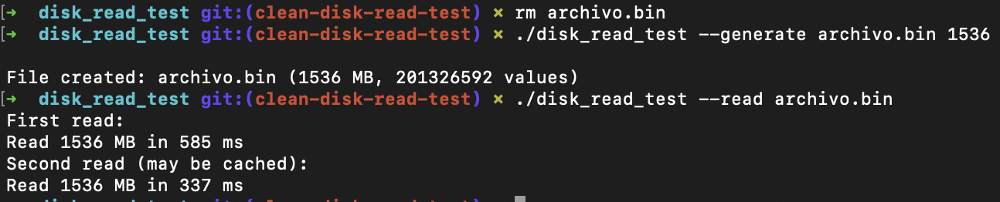
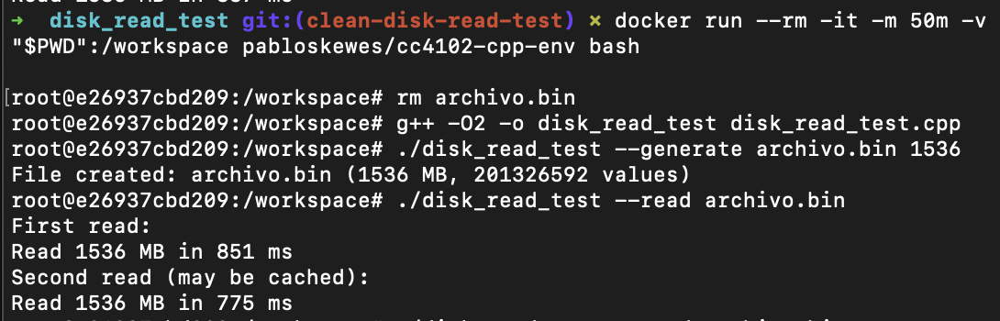

## disk_read_test

### Descripción

Este programa permite:

- Generar un archivo binario de números aleatorios de 64 bits de tamaño configurable (en MB).
- Leer ese archivo en bloques de 1 MB y medir el tiempo de lectura.

El objetivo es experimentar con el comportamiento del sistema operativo respecto al caching de archivos, y simular condiciones donde el archivo no cabe en memoria principal, forzando accesos a disco.

---

### Compilación

```bash
g++ -O2 -o disk_read_test disk_read_test.cpp
```

---

### Uso

#### 1. Generar un archivo binario

```bash
./disk_read_test --generate archivo.bin 1536
```

Esto crea un archivo binario llamado `archivo.bin` de **1.5 GB** (1536 MB), lleno de enteros aleatorios de 64 bits.

---

#### 2. Leer el archivo

```bash
./disk_read_test --read archivo.bin
```

Esto leerá el archivo dos veces, midiendo el tiempo de lectura en cada pasada.

El objetivo es **observar si la segunda lectura es significativamente más rápida** (lo que indicaría que el sistema operativo cacheó el archivo), o si ambas toman tiempos similares (lo que sugiere que se está leyendo desde disco en ambas ocasiones).

Para este caso, lo normal es que la segunda lectura sea más rápida, ya que el sistema operativo cacheó el archivo.

#### 3. Limitar memoria

Ahora, nos gustaría simular que el archivo no cabe en memoria, y que el sistema operativo deba leerlo desde disco.

Para simular que el sistema tiene solo **50 MB de memoria disponible para el proceso**, se puede usar:

```bash
docker run --rm -it -m 50m -v "$PWD":/workspace pabloskewes/cc4102-cpp-env bash
```

Este comando realiza lo siguiente:

- Descarga automáticamente una imagen de Docker con todo lo necesario para compilar y ejecutar el programa desde Docker Hub. Se puede encontrar en [cc4102-cpp-env](https://hub.docker.com/r/pabloskewes/cc4102-cpp-env).
- Limita la memoria virtual a 50 MB.
- Monta el directorio actual en el contenedor en el directorio `/workspace`. Es decir, todos los archivos que se encuentren en el directorio actual podrán ser accedidos dentro del contenedor
- Ejecuta un contenedor interactivo: una shell que permite ejecutar comandos dentro del contenedor.

Si todo funciona bien, se debería ver en entrada de la terminal algo como:

```
root@<hash>:/workspace#
```

Luego, se puede ejecutar el programa igual que antes. Se debe volver a compilar el programa dentro del contenedor.

### Resultado esperado

Ejecución normal:



Ejecución con límite de memoria:



---

### Notas

- En **macOS**, el comando `ulimit -v` **no funciona**. El sistema operativo no permite limitar la memoria virtual de un proceso desde la línea de comandos.
- El programa utiliza bloques de 1 MB para leer el archivo, definidos por la constante `BUFFER_SIZE`.
