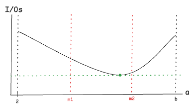

## Acerca de la búsqueda del "a" óptimo en la tarea

En esta tarea se requiere encontrar el valor óptimo de `a`, que representa la cantidad de particiones que se hacen en cada nivel recursivo del algoritmo. Este mismo valor se usará luego en Quicksort externo para que la comparación entre ambos algoritmos sea justa.

Lo que se busca optimizar es la cantidad total de accesos a disco (I/Os), ya que ese es el costo dominante en el modelo de memoria externa. Por lo tanto, el mejor valor de `a` será aquel que minimice los I/Os al ejecutar Mergesort externo sobre un archivo de prueba (de tamaño 60M).

Para Quicksort externo, se necesitan `a - 1` pivotes que deben caber en un solo bloque de tamaño `B`. Como cada pivote ocupa 8 bytes (64 bits), el número máximo de pivotes que caben en un bloque es `b = B / 8`.  
Por ejemplo, si `B = 4096`, entonces `b = 512`, y el valor de `a` debe estar en el rango `[2, 512]`.

Para no tener que probar todos los posibles valores de `a` entre 2 y `b`, se puede usar [**búsqueda ternaria**](https://cp-algorithms.com/num_methods/ternary_search.html?utm_source=chatgpt.com), asumiendo que la función que relaciona `a` con los I/Os tiene un comportamiento [**unimodal**](https://www.geeksforgeeks.org/mathematics-unimodal-functions-bimodal-functions/): primero baja, llega a un mínimo, y luego sube.

Esta suposición tiene sentido porque:

- Si `a` es muy pequeño (por ejemplo 2), el árbol de recursión es más alto y hay más niveles, lo que implica más pasadas por el archivo → más I/Os.
- Si `a` es muy grande (cerca de `b`), se mergean muchos archivos a la vez, lo que genera más accesos aleatorios al disco → también más I/Os.
- Entonces es razonable esperar que haya un mínimo intermedio en ese rango.

La figura siguiente ilustra cómo podría verse esta gráfica:

En este ejemplo, se evalúa la cantidad de I/Os al usar los valores `m1` y `m2`, que están ubicados a un tercio y dos tercios del intervalo. Como `m2` da menos I/Os que `m1`, se puede asumir que el mínimo no está entre `2` y `m1`, así que se descarta ese tercio y se continúa buscando en el intervalo `[m1, b]`.

Este proceso se repite: en cada paso se recalculan nuevos `m1` y `m2` dentro del intervalo actual, se evalúan, y se descarta un tercio del dominio según cuál dé mejores resultados.  
Al final, cuando el intervalo es muy pequeño (por ejemplo, tiene 3 o 4 valores), se prueban todos directamente y se elige el mejor.

Este método permite encontrar el mejor `a` de forma eficiente, lo cual es importante considerando que cada evaluación implica ejecutar Mergesort sobre un archivo pesado.
